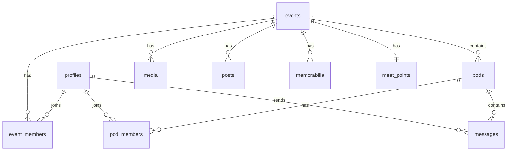

# Database Architecture & Philosophy

> **Purpose**: This document outlines the database design philosophy, architecture decisions, and data patterns for the crew-generator application.

## 🎯 Design Philosophy

### Core Principles:
1. **Performance First** - Every table has strategic indexes for optimal query performance
2. **Security by Design** - Row Level Security (RLS) ensures data privacy and access control
3. **Scalability** - Structure supports growth from MVP to thousands of users
4. **Real-time Ready** - Optimized for live updates and chat functionality
5. **Data Integrity** - Foreign keys and constraints maintain consistency

### Architecture Approach:
- **Event-Centric**: Everything revolves around concert/event experiences
- **Community-Driven**: Focus on social connections and group formation
- **Privacy-Conscious**: Users control their data visibility and participation

## 📊 Database Schema Overview

### Core Entities:



## 🗃 Table Structure & Purposes

### 1. **profiles** - User Identity
```sql
-- Core user information and preferences
profiles {
  id: uuid (primary, references auth.users)
  display_name: text
  email: text
  avatar_url: text
  ig_url: text
  reveal_ig: boolean
}
```
**Purpose**: Minimal user profile focused on concert/event context  
**Philosophy**: Users control visibility of personal information

### 2. **events** - Concert/Event Experiences
```sql
events {
  id: uuid (primary)
  slug: text (unique)
  artist: text
  city: text
  venue: text
  date_utc: timestamptz
}
```
**Purpose**: Central entity representing concerts, festivals, or music events  
**Philosophy**: Public information that anyone can discover and join

### 3. **event_members** - Event Participation
```sql
event_members {
  event_id: uuid (references events)
  user_id: uuid (references profiles)
  vibe_badges: jsonb[]
  joined_at: timestamptz
  PRIMARY KEY (event_id, user_id)
}
```
**Purpose**: Track who's attending which events with optional vibe indicators  
**Philosophy**: Explicit opt-in to event communities

### 4. **pods** - Small Group Formation
```sql
pods {
  id: uuid (primary)
  event_id: uuid (references events)
  name: text
  created_by: uuid (references profiles)
  created_at: timestamptz
}
```
**Purpose**: Small groups (max 5 people) for closer coordination within events  
**Philosophy**: Intimate connections within larger event communities

### 5. **pod_members** - Pod Participation
```sql
pod_members {
  pod_id: uuid (references pods)
  user_id: uuid (references profiles)
  role: text (default 'member')
  joined_at: timestamptz
  PRIMARY KEY (pod_id, user_id)
}
```
**Purpose**: Track pod membership with role-based permissions  
**Philosophy**: Self-organizing small groups with clear membership

### 6. **messages** - Real-time Communication
```sql
messages {
  id: uuid (primary)
  pod_id: uuid (references pods)
  user_id: uuid (references profiles)
  text: text
  created_at: timestamptz
}
```
**Purpose**: Pod-based chat for coordination and connection  
**Philosophy**: Private communication within trusted small groups

### 7. **media** - Photo/Video Sharing
```sql
media {
  id: uuid (primary)
  owner_id: uuid (references profiles)
  event_id: uuid (references events)
  pod_id: uuid (references pods, nullable)
  url: text
  kind: enum('image', 'video')
  created_at: timestamptz
}
```
**Purpose**: Event memories shared within event or pod communities  
**Philosophy**: Visual storytelling and memory preservation

### 8. **posts** - Event Content
```sql
posts {
  id: uuid (primary)
  event_id: uuid (references events)
  user_id: uuid (references profiles)
  kind: enum('text', 'poll', 'hype')
  body: jsonb
  created_at: timestamptz
}
```
**Purpose**: Event-specific content, discussions, and engagement  
**Philosophy**: Community-driven event experiences

### 9. **memorabilia** - Personal Event Records
```sql
memorabilia {
  id: uuid (primary)
  event_id: uuid (references events)
  user_id: uuid (references profiles)
  opener_guess: text
  peak_moment: text
  song_of_night: text
  crowd_energy: text
  notes: text
  created_at: timestamptz
}
```
**Purpose**: Personal reflection and memory keeping for each event  
**Philosophy**: Individual experience capture within shared events

### 10. **meet_points** - Coordination Information
```sql
meet_points {
  event_id: uuid (primary, references events)
  title: text
  description: text
  when_local: text
  created_by: uuid (references profiles)
  updated_at: timestamptz
}
```
**Purpose**: Shared coordination information for event attendees  
**Philosophy**: Community collaboration for better event experiences

### 11. **reports** - Content Moderation
```sql
reports {
  id: uuid (primary)
  reporter: uuid (references profiles)
  target_type: enum('post', 'message', 'media', 'profile')
  target_id: uuid
  reason: text
  created_at: timestamptz
}
```
**Purpose**: Community-driven content moderation and safety  
**Philosophy**: User empowerment for maintaining safe spaces

## 🔒 Security Model (Row Level Security)

### RLS Philosophy:
- **Principle of Least Privilege**: Users only see data they should access
- **Community-Based Access**: Event membership gates most content access
- **Pod Privacy**: Messages and pod details only visible to members
- **Owner Controls**: Users control their own content and profile data

### Access Patterns:
1. **Public Data**: Events, event details (discoverable)
2. **Community Data**: Event posts, media, members (event membership required)
3. **Private Data**: Pod messages, personal memorabilia (explicit membership/ownership)
4. **Personal Data**: User profiles, own content (user ownership)

### Optimized RLS Policies:
- Use `(SELECT auth.uid())` pattern to prevent row-by-row re-evaluation
- Subquery-based membership checks for better performance
- Simplified policies to avoid circular dependencies

## ⚡ Performance Strategy

### Indexing Philosophy:
- **Foreign Key Indexes**: Every foreign key has a corresponding index
- **Composite Indexes**: Frequently joined columns indexed together
- **Ordered Indexes**: Time-series data indexed with DESC for recent-first queries
- **Query-Specific Indexes**: Based on actual application query patterns

### Strategic Indexes Applied:
```sql
-- Membership and relationship lookups
idx_event_members_event_id, idx_event_members_user_id, idx_event_members_event_user
idx_pod_members_pod_id, idx_pod_members_user_id, idx_pod_members_pod_user

-- Time-ordered content
idx_messages_pod_id_created (pod_id, created_at DESC)
idx_media_event_id_created (event_id, created_at DESC)
idx_posts_event_id_created (event_id, created_at DESC)

-- Discovery and filtering
idx_events_date_utc, idx_events_city, idx_events_artist
```

### Query Optimization Patterns:
1. **Batch Operations**: Single queries instead of N+1 patterns
2. **Selective Fetching**: Only query needed columns and relationships
3. **Efficient Joins**: Proper indexing supports fast table joins
4. **Realtime Optimization**: Minimal database load for live features

## 🔄 Data Flow Patterns

### Event Discovery & Joining:
1. User browses public events (no auth required)
2. User joins event → creates `event_members` record
3. User gains access to event community (posts, media, other members)
4. User can create or join pods within the event

### Pod Communication:
1. Event member creates pod (max 5 members)
2. Other event members can join pod
3. Pod members gain access to private chat
4. Real-time message delivery within pod

### Content Sharing:
1. Event members can post content visible to all event attendees
2. Pod members can share media within pod or broader event
3. Individual users maintain personal memorabilia records

## 🚀 Scalability Considerations

### Current Optimizations:
- Strategic database indexing for sub-second queries
- Efficient RLS policies preventing unnecessary computation
- Optimized real-time subscriptions reducing database load

### Future Scaling Strategies:
1. **Read Replicas**: Separate read/write workloads
2. **Caching Layer**: Redis for frequently accessed data
3. **Media CDN**: External storage for images/videos
4. **Connection Pooling**: Optimize database connection usage
5. **Horizontal Partitioning**: Event-based data sharding if needed

## 🛠 Development Guidelines

### Adding New Tables:
1. Define clear purpose and relationships
2. Add appropriate RLS policies using `(SELECT auth.uid())` pattern
3. Create indexes for foreign keys and query patterns
4. Document access patterns and security model
5. Test performance with realistic data volumes

### Modifying Existing Schema:
1. Consider impact on existing RLS policies
2. Add indexes for new query patterns
3. Update documentation
4. Test with existing data
5. Plan migration strategy for production

### Query Development:
1. Use `EXPLAIN ANALYZE` to verify index usage
2. Avoid N+1 patterns - batch operations when possible
3. Test RLS policy performance with various user scenarios
4. Monitor query performance in Supabase dashboard

---

**Architecture Date**: August 2024  
**Performance Status**: Optimized for production scale  
**Security Model**: RLS-based with community access patterns ✅


